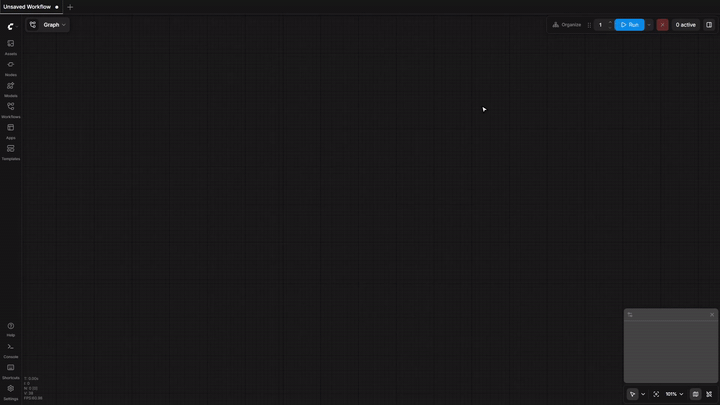

# ComfyUI Command Palette



A ComfyUI custom node pack that adds a frontend command palette for faster navigation and common actions. Created with [comfyui-custom-node-template](https://github.com/PBandDev/comfyui-custom-node-template).

## Features

- `Ctrl/Cmd+K`: open the palette through ComfyUI's keybinding system.
- `>`: run commands exposed by ComfyUI and installed frontend extensions.
- `@`: find and jump to nodes in the current graph.
- `+`: add installed nodes.
- `#`: open saved workflows and templates.
- `?`: open read-only help and about entries.

Settings add an adjustable node-jump zoom level and an option to hide API-only nodes from `+` search.

## Install

1. Open ComfyUI
2. Go to **Manager > Custom Node Manager**
3. Search for **ComfyUI Command Palette**
4. Click **Install**

## Development

```bash
pnpm install
uv sync --locked --group dev
pnpm typecheck
pnpm test:unit
```

Additional commands:

```bash
pnpm dev
pnpm test
pnpm test:e2e
pnpm open:e2e
```

`pnpm test:e2e` builds the frontend, provisions a scoped ComfyUI install, and runs the Playwright smoke suite.
`pnpm open:e2e` builds the frontend, provisions the same scoped ComfyUI install, and opens it for manual testing at `http://127.0.0.1:8199`.